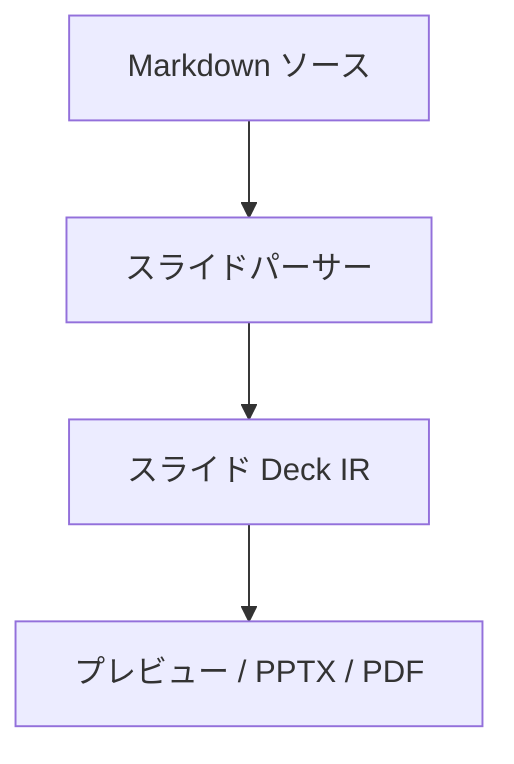

# md-tech-slide

[English](./README.md) | 日本語

md-tech-slide は、Markdown から技術プレゼンテーションスライドを生成・プレビューするための Visual Studio Code 拡張機能です。

スライドを平坦な画像として出力する従来のツールとは異なり、md-tech-slide は再編集可能なネイティブの PowerPoint テキストボックス・図形・テーブルを生成し、ヘッドレスブラウザ連携による高品質な PDF スライドの出力にも対応しています。

---

## 主な特徴

- ネイティブ PowerPoint（PPTX）生成: PptxGenJS を採用し、画像化ではなく編集可能な図形・テキスト枠・表を出力。
- マルチカラムレイアウト: 直感的な Fenced Divs 記法（`::: columns`, `::: column`）による 2カラム・3カラム・比率指定（`ratio="2:1"` 等）レイアウト。
- Mermaid ダイアグラム対応: フローチャートやシーケンス図等をベクター SVG として PowerPoint OpenXML（`ppt/media/*.svg`）および高品質 PDF スライドへ直接埋め込み。
- シンタックスハイライト: Shiki エンジンによる美しいコードブロック描画と PowerPoint 書式付きテキスト枠へのマッピング。
- リアルタイムプレビュー: エディタと双方向スクロール同期する Webview スライドプレビュー。
- 高品質 PDF エクスポート: ローカル環境の Google Chrome や Microsoft Edge を自動検出し、余分な設定なしでスライド PDF を出力。
- エディタ入力支援: スライド区切り、カラム構造、Mermaid 図の入力スニペットと、閉じ忘れ等を検知するリアルタイム構文検証。

---

## 動作要件

- Visual Studio Code `^1.101.0` 以上
- Node.js `>=22.12.0`（Node 20 は非サポート）
- Google Chrome または Microsoft Edge がローカルにインストールされていること（PDF エクスポートおよび Mermaid レンダリングで使用）

---

## 記法ガイド

### Frontmatter 設定

スライド全体のメタデータやデフォルト値は、Markdown 先頭の YAML ブロックで設定します。

| キー          | 型               | デフォルト値 | 説明                                                   |
| :------------ | :--------------- | :----------- | :----------------------------------------------------- |
| `title`       | string           | `""`         | プレゼンテーションのタイトル                           |
| `author`      | string           | `""`         | 発表者名                                               |
| `theme`       | string           | `"default"`  | スライドテーマ（`default`, `corporate`, `dark`）       |
| `aspectRatio` | string           | `"16:9"`     | アスペクト比（`16:9`, `4:3`）                          |
| `paginate`    | boolean          | `true`       | フッターのページ番号表示（`true`, `false`）            |
| `font`        | string           | テーマ依存   | 見出しおよび本文の簡易フォント指定                     |
| `codeFont`    | string           | テーマ依存   | コードブロックおよびインラインコードのフォント指定     |
| `fonts`       | mapping          | テーマ依存   | `body`, `heading`, `code` の個別詳細フォント指定       |
| `fontSize`    | number / mapping | 各要素依存   | 基準文字サイズ（pt、8〜96pt）。旧数値型または詳細指定  |
| `fontFamily`  | string           | -            | 非推奨（互換用）。`font` または `fonts` への移行を推奨 |

```markdown
---
title: 'サンプルプレゼンテーション'
author: '開発チーム'
theme: 'corporate'
font: 'BIZ UDPGothic'
codeFont: 'Cascadia Code'
aspectRatio: '16:9'
paginate: true
---

# タイトルスライド

md-tech-slide へようこそ。

########

# 次のスライド

スライド本文のコンテンツを記述します。
```

### フォント・文字サイズ設定

Frontmatterからスライド全体で利用するフォントと基準文字サイズを柔軟にカスタマイズできます。

#### 1. 簡易形式（推奨）

見出し・本文に同じフォントを適用し、コードフォントを別途指定する最もシンプルな記法です。

```yaml
---
font: 'BIZ UDPGothic'
codeFont: 'Cascadia Code'
---
```

#### 2. 詳細形式

見出し・本文・コード用フォントや基準文字サイズを個別に指定します。

```yaml
---
fonts:
  heading: 'BIZ UDPGothic'
  body: 'Yu Gothic'
  code: 'Cascadia Code'
fontSize:
  heading: 28
  body: 18
---
```

- 文字サイズの単位はポイント（pt）で、許容範囲は `8pt` 〜 `96pt` です。
- `fontSize.heading` はスライドタイトルの基準値（既定: 26pt）として扱われ、タイトルスライドや小見出しも既存の視覚階層比率を保って追従します。
- `fontSize.body` は通常本文・リストの基準値（既定: 15pt）として扱われ、表やコード、フッターも比率を保って追従します。詳細形式で `fontSize.body` のみを指定した場合、見出しサイズは既定値を維持します。

#### 3. 優先順位ルール

フォント名は以下の優先順位で解決されます。詳細形式で一部のロールのみを指定した場合は、未指定のロールのみが独立してフォールバックします。

- 本文系: `fonts.body` > `font` > `fontFamily` > テーマの既定フォント > 組み込み既定値
- 見出し系: `fonts.heading` > `font` > `fontFamily` > テーマの既定フォント > 組み込み既定値
- コード系: `fonts.code` > `codeFont` > テーマの既定フォント > 組み込み既定値

#### 4. 旧形式との互換性と非推奨警告

旧仕様の `fontFamily` および数値型の `fontSize`（例: `fontSize: 18`）も後方互換性のため引き続き利用可能です。
旧形式が指定された場合は、ビルドを妨げない警告 Diagnostic（`frontmatter-deprecated-key`）が出力され、推奨記法への案内が表示されます。

#### 5. レンダリング仕様・環境フォントについて

- WebviewプレビューおよびPDF: 指定されたフォントが存在しない場合、OS標準の安全なフォールバックフォントスタック（`-apple-system, BlinkMacSystemFont, "Segoe UI", "Hiragino Kaku Gothic ProN", "Yu Gothic", sans-serif` 等）が適用されます。
- PowerPoint（PPTX）: ファイルサイズ肥大化や互換性問題を避けるため、フォントファイルのプレゼンテーション内への埋め込みは行いません。閲覧環境に指定フォントがインストールされていない場合は、PowerPoint側で代替フォントが適用され、改行や文字幅などのレイアウトに差異が生じる可能性があります。
- 推奨フォント例:
  - 日本語向け: `BIZ UDPGothic`, `Yu Gothic`, `Meiryo`
  - コード向け: `Cascadia Code`, `Consolas`, `Fira Code`
- ※ OSのインストール済みフォント自動列挙や診断機能（`Run Doctor`）は、将来バージョン（Phase 10）での提供を検討しております。

### マルチカラムレイアウト

`::: columns` および `::: column` ブロックを用いてスライドをカラム分割できます。

````markdown
::: columns ratio="2:1"
::: column

### 左カラム（メイン）

- 主要な技術的議論
- コード実装の解説

```typescript
export interface SlideDeck {
  readonly slides: readonly Slide[];
}
```
````

:::
::: column

### 右カラム（サイド）

- 補足事項
- アーキテクチャの要約
  :::
  :::

`````

### Mermaid ダイアグラム

コードフェンス ` ```mermaid ` 内に図を記述します。描画された図はベクター SVG として PowerPoint OpenXML（`ppt/media/*.svg`）へ直接埋め込まれ、PDF エクスポート時も拡大に耐える鮮明さで出力されます。

````markdown

`````

フローチャート（`flowchart`, `graph`）、シーケンス図（`sequenceDiagram`）、クラス図（`classDiagram`）、状態遷移図（`stateDiagram-v2`）、ER図（`erDiagram`）などの主要な図種をサポートしています。Mermaid ブロックはマルチカラムスロット（`::: column`）内でも利用可能です。

### スピーカーノート

各スライドの発表者用メモは `::: note` ブロックまたは HTML コメント形式（`<!-- note: ... -->`）で記述します。PowerPoint のノート領域へ出力されます。

```markdown
::: note
画像化されたスライドに対するネイティブテキストボックスの編集上の利点を説明してください。
:::
```

---

## 使い方

### 1. プレビューを開く

1. VS Code で Markdown プレゼンテーションファイルを開きます。
2. コマンドパレット（`Ctrl+Shift+P` / `Cmd+Shift+P`）を開きます。
3. `md-tech-slide: Open Slide Preview` を実行します（エディタ右上のアイコンからも開けます）。

### 2. PowerPoint（PPTX）へのエクスポート

1. コマンドパレット（`Ctrl+Shift+P` / `Cmd+Shift+P`）を開きます。
2. `md-tech-slide: Export to PowerPoint (PPTX)` を実行します。
3. 保存ダイアログで出力先ファイルを指定します。

### 3. PDF へのエクスポート

1. コマンドパレット（`Ctrl+Shift+P` / `Cmd+Shift+P`）を開きます。
2. `md-tech-slide: Export to PDF Slide` を実行します。
3. 保存ダイアログで出力先ファイルを指定します。

---

## 拡張機能の設定

VS Code の設定画面から以下の動作をカスタマイズできます。

- `mdTechSlide.defaultTheme`: デフォルトのテーマ（`default`, `corporate`, `dark`）。
- `mdTechSlide.defaultAspectRatio`: デフォルトのスライドアスペクト比（`16:9`, `4:3`）。
- `mdTechSlide.browserPath`: Mermaid 図のレンダリングおよび PDF 出力に使用する Google Chrome / Microsoft Edge の実行ファイルパスの手動指定。
- `mdTechSlide.export.browserPath`: ブラウザーパス手動指定の互換用設定。

---

## 提供コマンド一覧

| コマンド                    | 説明                                                           |
| --------------------------- | -------------------------------------------------------------- |
| `md-tech-slide.openPreview` | 現在開いている Markdown ドキュメントのスライドプレビューを表示 |
| `md-tech-slide.exportPPTX`  | 現在のスライドを PowerPoint（PPTX）形式でエクスポート          |
| `md-tech-slide.exportPDF`   | 現在のスライドを PDF スライド形式でエクスポート                |

---

## セキュリティと安全設計

md-tech-slide は厳格な多層防御アプローチを適用しています。

- 厳格な Content-Security-Policy（CSP）: Webview プレビューでは外部スクリプトやインライン `style="..."` 属性の実行を全面遮断し、描画ごとの暗号学的 nonce を要求します。
- パストラバーサル防止: スライドから参照されるローカル画像やリソースはワークスペース配下に厳密に制限され、許可範囲外（`../` 等）へのアクセスは遮断されます。
- リソース保護: 20MBを超える過大なファイルの読み込みを防止し、ホワイトリストに登録された画像形式（`.png`, `.jpg`, `.jpeg`, `.svg`, `.webp`）のみを処理します。
- 危険なスキームの無害化: ハイパーリンク内の危険な URL スキーム（`javascript:` やローカル `file:` 等）はプレビューおよび出力時に自動的に無害化・排除されます。

---

## ライセンス

[MIT License](LICENSE)
