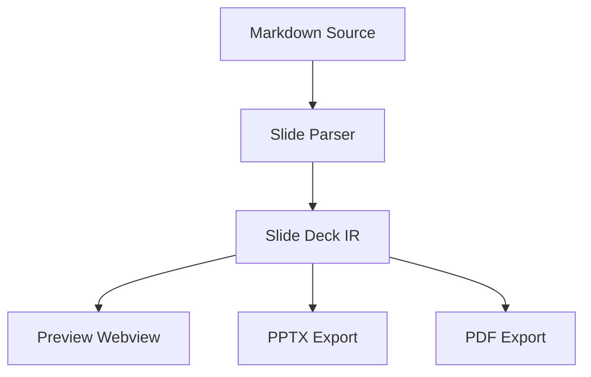
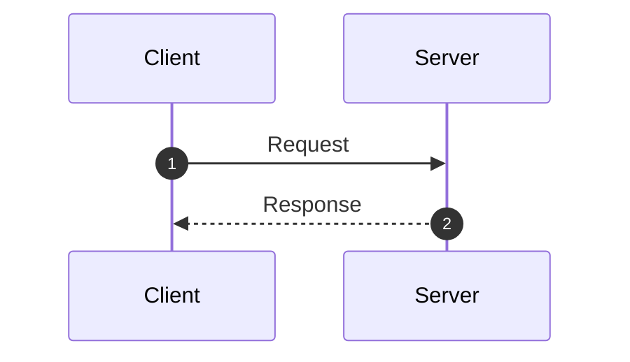

# Mermaid Diagram Showcase

Mermaid diagrams in Markdown Tech Slide.

########

## Architecture Flowchart

########

## Multi-Column Diagram

::: columns ratio="1:1"
::: column

### Sequence Diagram

:::
::: column

### Description

- Seamless vector rendering
- Native OpenXML vector SVG embedding in PPTX
- Crisp high-resolution rendering in PDF

:::
:::
