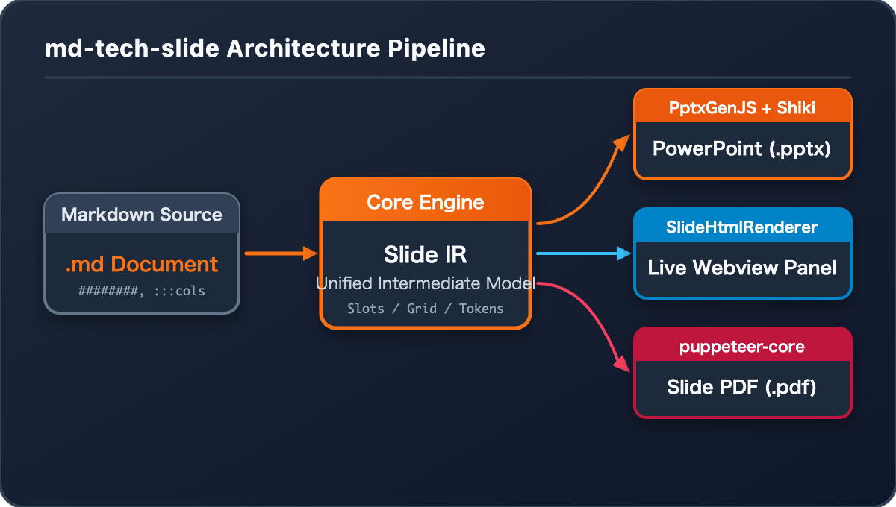

# Technical Slide Showcase

Welcome to md-tech-slide presentation engine.

########

## 2-Column Architecture

::: columns ratio="2:1"
::: column

### Left Column (Main)

- Component-based rendering
- Native PowerPoint shapes and text frames
- Auto text shrink support

```typescript
export interface SlideDeck {
  readonly slides: readonly Slide[];
}
```

:::
::: column

### Right Column (Side)



Supplementary details and metrics.
:::
:::

::: note
This is a speaker note for the 2-column slide.
Remember to explain the benefit of native PowerPoint text frames.
:::

########

## Code and Tables

Here is a comparison table and code:

| Feature       | md-tech-slide | Marp     |
| ------------- | ------------- | -------- |
| Editable Text | Yes           | No       |
| Multi Column  | Native        | HTML/CSS |

```python
def generate_slide():
    return "Native PPTX"
```

<!-- note: Another speaker note using comment syntax -->
